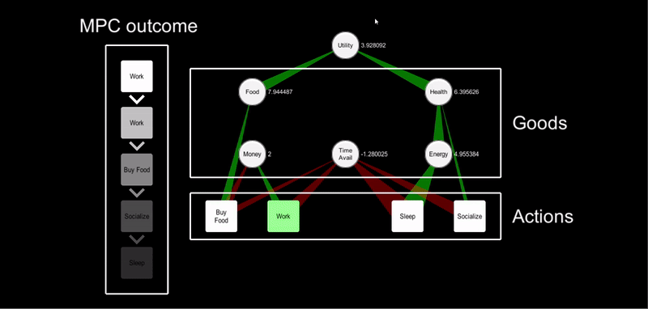
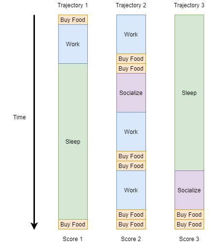

# Utility Networks
—  Reverse Engineering Society — 

Utility networks consist of networks of goods (each with its own utility function) that can be interchanged by applying actions (see gif). E.g food and money are goods and one can interchange them via the action “Buy food”. The objective is therefore to apply a sequence of actions to interchange goods such that long-term accumulated utility is maximized. This way, behavior can be formulated as a RL problem where the reward is utility.

One can theefore use an RL method to find optimal policies to maximize long-term accumulated utility. The current approach to do that is using a search method based on Model Predictive Control (see picture below) that finds the best immediate action considering a limited time horizon. This method serves well to demonstrate the potential of utility networks but since it is not learning over time it is not capable of finding long-term sequences of actions that lead to high utility. 

  

The utility network parameters define the functions that describe how the different goods and actions are related. E.g how much money does working generate, how much money does food cost, how much utility is associated to food, etc. These parameters are currently handcrafted but the idea is to use different optimization methods to tune the parameters such that the behavior that emerges from the agent (sequence of actions taken) is as representative as possible to human behavior. This could be done by:
- Using genetic algorithms instantiating multiple agents and evaluating them on a fitness score that is higher when their behavior is more similar to human behavior (acessed by humans)
- Using an alternative supervised learning method to mimic human behavior based on the utility network (TBD)

Creating a toy example of a utility network on a simple agent 
Applying a search method to find the best action considering a limited time horizon (Model Predictive Control)
What I would like to explore:

Substituting the current search method with a learning method (maybe explore different RL methods)
Carry out different sensitivity analysis on how tuning the utility network parameters affects behavior. For example, what happens when we associate more direct utility to money (we probably buy less products, save more, spend more time working, our health and energy reduce, etc.)
Create multi-agent scenarios with limited resources that agents are competing for and see how behavior changes.

## End goal

The idea is to create a model of a society  (that would be simulated) that is representative of the way that humans interact with each other and with other institutions such as enterprises and governments. Such simulation would have different types of agents on it with different reward functions. Example:

- Human: with reward function to optimize its own well-being and the well-being of their close friends and family, etc.
- Enterprise: with reward function to optimize profit, well-being of their employees, etc.
- Government: with reward function to optimize economical growth, well being of their population, etc.

By 'interacting' what I mean is not what they decide to wear or what they decide to talk about, but the important socioeconomic actions that they make, such as the quantity that they buy of a product, the probability that they get fired, or other things related to microeconomics.

The reason why it would be useful to have such simulation is because I believe the following: 

The way that humans interact with each other and with other institutions is a complex phenomena from which complex and patterns emerge. However, if we build a representative simulation of human interactions, the patters that emerge stop being complex and become only complicated. With complicated stuff, we can deal (ML can be applied to detect and report such patterns, and RL can be applied to take advantage of such patterns and optimize our actions).

The end goal with the project is to create a simulation of a society — A  set of humans and other type of agents such as enterprises or governments that interact with each other while trying to maximize their own utility — and come up with different methods to make the society simulation as representative as today's society (maybe use genetic algorithms to tune the utility network parameters such that they mimic today’s behavior and combine it with RL to optimize agent behavior based on the given utility network. If the level of representation was good enough the simulation could be used to test the socioeconomic impact of different policies applied by governments or event to find optimal policies using RL to maximize long-term metrics of interest included in the utility such as economic growth or global welfare.

I here attach my academic CV.

You can see a portfolio with visual descriptions of previous projects I have worked on:

 Please let me know if you need more details (transcripts), etc.

Governments could use the simulation to test different policies and evaluate the benefits and downsides of proposed policies both in the economic growth and in the well-being of their population. One could test for example what the effect of increasing the minimum wage would have on the economy of the country and the well-being of their citizens both in the short term and in the long term.

Different RL techniques could be used to find optimal policies (haha this would literally be a policy network). For example, one could model a reward function that maximizes well-being and economical growth of the population. The rest is only math :) I would imagine that by using such tool we would not only refine the current way of doing politics but maybe we would find policies that are not intuitive using human thinking but are actually optimal (in the same way that AlphaGo discovered move 37, a move that was out of the bounds of human intuition at the time, but it turned out to be optimal, and it is now being used by professional players).
