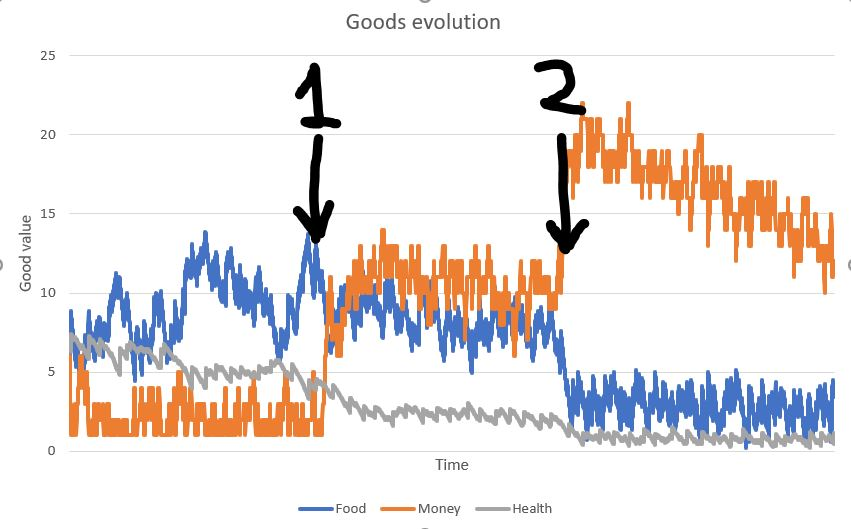

# Utility Networks
—  Reverse Engineering Society — 

Utility networks consist of networks of goods (each with its own utility function) that can be interchanged by applying actions (see gif). E.g food and money are goods and one can interchange them via the action “Buy food”. The objective is therefore to apply a sequence of actions to interchange goods such that long-term accumulated utility is maximized. This way, behavior can be formulated as a RL problem where the reward is utility.

The utility network parameters define the functions that describe how the different goods and actions are related. E.g how much money does working generate, how much money does food cost, how much utility is associated to food, etc. These parameters are currently handcrafted but the idea is to use different optimization methods to tune the parameters such that the behavior that emerges from the agent (sequence of actions taken) is as representative as possible to human behavior. This could be done by:

- Using genetic algorithms instantiating multiple agents and evaluating them on a fitness score that is higher when their behavior is more similar to human behavior (assessed by humans)
- Using an alternative supervised learning method to mimic human behavior based on the utility network (TBD)

## Example
The following is a toy example of a utility network with very few actions and goods but complete enough to show the functioning and potential of utility networks. The gif below is a visual representation of the actions being taken by the agent in with the following utility network:

Goods:
- Food: Contributes to utility. Decreases every timestep (food is reduced throughout the day because of feeding)
- Money: Doesn't contribute to anything but allows to buy food via the action: "buy food" when balance is > 0
- Energy: Contributes to health. Decreases every timestep (energy is reduced throughout the day)
- Health: Contributes to utility. Decreases every timestep (health is reduced throughout life)
- Time available: Doesn't contribute to anything but allows to apply other actions when value is > 0. Increases every timestep
- Utility (can be treated as a good)

Actions
- Buy food: Reduces time and money and increases food
- Work: Reduces time and increases money
- Sleep: Reduces time and increases energy
- Socialize: Reduces time and increases health

The exact parameters that define the relations between goods and/or actions can be found in the Unity Project. 

The current approach to maximize long-term accumulated utility is to use a search method based on Model Predictive Control (see Figure 1) that finds the best immediate action considering a limited time horizon. This method serves well to demonstrate the potential of utility networks but since it is not learning over time it is not capable of finding long-term sequences of actions that lead to high utility. 

<figure class="image">
  
  <figcaption>Figure 1. Model Predictive Control diagram</figcaption>
</figure>

We see that in this case money is not directly associated to utility, but one can work to generate money and then go buy food, which produces utility. This is an interesting example where long-term thinking is important — if the agent was maximizing immediate utility it would never work, as it does not produce direct utility. 

### Behavior sensitivity analysis
Utility networks can be useful to carry out sensitivity analyses to see how tuning the relations between goods and/or actions (network parameters) affect behavior. The following example shows how behavior changes when we associate more direct utility to money. The results are generating by running MPC on the utility network described above and tuning the direct relationship between money and utility:

Before time (1) the direct utility of money is set to 0. After that, the direct utility of money is set to u(x) = 1 * log(x). We see that when utility is associated to money behavior changes in the following ways:
- Agent starts working more and thus generating more money
- Agent buys less food in order to save more
- Agent loses health because it spends less time sleeping and socializing

At time (2) the direct utility of money is set to u(x) = 5 * log(x), and we observe that the effects are magnified (health and food go down to marginal levels close and money increases due to more work being carried out). 

<figure class="image">
  
  <figcaption>Figure 2. Goods evolution</figcaption>
</figure>

Other interesting sensitivity analyses would be:
 - Observe how behavior changes when work produces more money. Do we work more hours? Fewer hours? How does that affect health? 
 - Observe what happens when food increases in price. Do we buy less food? Do we spend more money? 
 - Observe what happens when health has a greater impact on utility. Do we work less time? Do we sleep more? 
 - Many more

## End goal

The end goal with the project is to create a simulation of a society — A set of humans and other types of agents such as enterprises or governments that interact with each other while trying to maximize their own utility — and come up with different methods to make the society simulation as representative as today's society. An example of this would be

- Humans: with reward function to optimize their own well-being and the well-being of their close friends and family, etc.
- Enterprises: with reward function to optimize profit, well-being of their employees, etc.
- Governments: with reward function to optimize economical growth, well-being of their population, etc.

If the level of representation was good enough the simulation could be used to test the socioeconomic impact of different policies applied by governments or even to find optimal policies using RL to maximize long-term metrics of interest included in the utility such as economic growth or global welfare.

### Use cases of society simulation
Human behavior is a complex phenomenon from which complex and patterns emerge. Nevertheless, if we build a representative simulation of human interactions, the patterns that emerge stop being complex and become only complicated. With complicated patterns we can deal — we can use ML to detect and report such patterns, and RL can be applied to take advantage of such patterns and optimize our actions —. Some of the use cases are:

- Governments could use the simulation to test different policies and evaluate the benefits and downsides of proposed policies both in the economic growth and in the well-being of their population. One could test for example what the effect of increasing the minimum wage would have on the economy of the country and the well-being of their citizens both in the short term and in the long term.

- Different RL techniques could be used to optimize policy-making. For example, one could model a reward function that maximizes well-being and economical growth of the population. By using such a tool we would not only refine the current way of doing politics but maybe we would probably find policies that are not intuitive using human thinking but are actually optimal — the same way that AlphaGo discovered move 37, a move that was out of the bounds of human intuition at the time, but it turned out to be optimal, and it is now being used by professional players —.

The simulation could also be used to both test and optimize behavior for other types of agents such as enterprises or humans.
